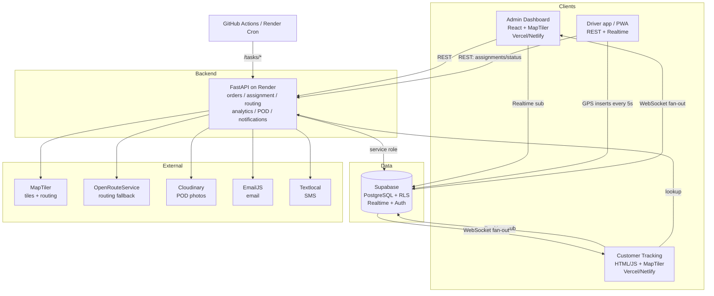

# BLA — Delivery Operations Platform

A monolithic, cost-optimized delivery operations platform (think a lean,
internal DHL/FedEx) for warehouse, dispatch, and drivers — plus a public
customer tracking page. The entire MVP runs on free tiers at **$0/month**.

> **Internal logistics system** for warehouse, dispatch, and drivers, with a
> simple customer tracking web page. No microservices, no customer mobile app
> initially.

---

## Overview

The platform handles the full delivery lifecycle:

- **Order intake** with line items and packages.
- **Driver assignment** with automatic route calculation (MapTiler → ORS fallback).
- **Live GPS tracking** — drivers stream coordinates every ~5s; staff and
  customers watch in real time over Supabase Realtime WebSockets.
- **Status progression** visible to customers:
  `received → on place → went for delivery → out for delivery → delivered`.
- **Proof of delivery** photo upload to Cloudinary.
- **Notifications** — EmailJS (order confirmations, daily summaries) and
  Textlocal SMS (status updates).
- **Analytics** for dispatch (totals, in-transit, delivered, active drivers).
- **Background jobs** — daily report + GPS cleanup via GitHub Actions or Render Cron.

---

## Architecture

**Monolithic.** A single FastAPI service holds all business logic. Supabase is
the primary database *and* the realtime backbone — most live updates are
database-change events fanned out by Supabase directly to browsers, so the
backend stays stateless and free-tier friendly. Static frontends are served
from Vercel/Netlify.



**Realtime data flow:** drivers insert `gps_tracking` rows → Supabase Realtime
broadcasts INSERTs → the admin map and customer page update markers live. The
backend does not sit in this hot path.

---

## Tech stack

| Layer            | Choice                                   | Free tier |
|------------------|------------------------------------------|-----------|
| Database         | Supabase PostgreSQL + RLS                | 500 MB DB, 1 GB storage |
| Realtime         | Supabase Realtime (WebSockets)           | included  |
| Auth             | Supabase Auth                            | 50k MAU   |
| Backend          | FastAPI on Render                        | free (spins down after 15 min) |
| Admin dashboard  | React + Vite + Tailwind + MapTiler GL JS | Vercel/Netlify free |
| Customer page    | Plain HTML/JS + MapTiler                 | Vercel/Netlify free |
| Maps & routing   | MapTiler (primary), OpenRouteService (fallback) | 100k loads/mo, 2k directions/day |
| Photos           | Cloudinary                               | 25 GB storage + 25 GB/mo |
| Email            | EmailJS                                  | 200 emails/mo |
| SMS              | Textlocal                                | free signup credits |
| Cron             | GitHub Actions or Render Cron            | 2,000 min/mo |
| Cache/pubsub     | Redis (Render-managed) — **deferred**    | scaling only |

---

## Repository structure

```
.
├── db/
│   ├── schema.sql            # PostgreSQL schema (SOURCE OF TRUTH) + RLS + realtime
│   └── seed.sql              # minimal example data
├── backend/                  # FastAPI monolith
│   ├── app/
│   │   ├── main.py
│   │   ├── core/             # config (pydantic settings) + supabase client
│   │   ├── routers/          # orders, drivers, analytics, tasks
│   │   ├── schemas/          # pydantic request/response models
│   │   ├── services/         # orders, routing, notifications, storage, realtime, analytics
│   │   └── models/           # placeholder (schema lives in db/)
│   ├── requirements.txt
│   └── render.yaml           # Render deployment blueprint
├── admin-dashboard/          # React + Tailwind + MapTiler (Vite)
│   ├── src/
│   ├── vercel.json / netlify.toml
│   └── package.json
├── customer-tracking/        # plain HTML/JS tracking page
│   ├── index.html / app.js / styles.css
│   └── config.example.js
├── .github/workflows/        # daily-report + gps-cleanup cron jobs
└── .env.example              # all backend env vars
```

---

## Database schema

`db/schema.sql` is the **source of truth**. Tables:

`users`, `customers`, `drivers`, `vehicles`, `warehouses`, `orders`,
`order_items`, `packages`, `inventory`, `delivery_assignments`, `gps_tracking`,
`delivery_status_history`, `payments`.

Highlights:

- **Enums:** `order_status` (`received`, `on_place`, `went_for_delivery`,
  `out_for_delivery`, `delivered`, `cancelled`, `failed`), plus
  `assignment_status`, `vehicle_type`, `payment_status`, `payment_method`,
  `user_role`.
- **Indexes** on all foreign keys and hot query columns (status, created_at,
  gps recorded_at).
- **Triggers:** auto `updated_at`; auto status-history logging + `delivered_at`.
- **Row Level Security** on every table (staff vs. driver vs. customer scoping;
  the backend uses the service role to bypass RLS as the trusted authority).
- **Realtime publication** for `gps_tracking`, `delivery_assignments`,
  `orders`, `delivery_status_history`.
- **`cleanup_gps_tracking(retention_days)`** maintenance function for the cron job.

---

## Local setup

### 0. Prerequisites
- A free Supabase project, plus MapTiler / Cloudinary / EmailJS / Textlocal /
  OpenRouteService accounts.
- Python 3.11+, Node 18+, and `psql` (or use the Supabase SQL editor).

### 1. Database (Supabase)
```bash
# Apply schema, then seed (use your project's direct connection string).
psql "$SUPABASE_DB_URL" -f db/schema.sql
psql "$SUPABASE_DB_URL" -f db/seed.sql
```
Or paste each file into the Supabase **SQL Editor** and run.

### 2. Backend (FastAPI)
```bash
cd backend
python -m venv .venv && source .venv/bin/activate
pip install -r requirements.txt
cp ../.env.example .env      # fill in your keys
uvicorn app.main:app --reload --port 8000
# docs: http://localhost:8000/docs
```

### 3. Admin dashboard (React)
```bash
cd admin-dashboard
npm install
cp .env.example .env         # VITE_SUPABASE_URL / _ANON_KEY / _MAPTILER / API URL
npm run dev                  # http://localhost:5173
```

### 4. Customer tracking (static)
```bash
cd customer-tracking
cp config.example.js config.js   # public anon + MapTiler keys
python3 -m http.server 8080      # http://localhost:8080
# deep link: index.html?order=BLA-2026-0002
```

---

## Environment variables

All backend variables are documented in [`.env.example`](.env.example):
`SUPABASE_URL`, `SUPABASE_ANON_KEY`, `SUPABASE_SERVICE_KEY`, `SUPABASE_DB_URL`,
`MAPTILER_API_KEY`, `OPENROUTESERVICE_API_KEY`, `CLOUDINARY_URL`
(or `CLOUDINARY_CLOUD_NAME`/`_API_KEY`/`_API_SECRET`), `EMAILJS_SERVICE_ID`,
`EMAILJS_TEMPLATE_ID`, `EMAILJS_USER_ID`, `EMAILJS_PRIVATE_KEY`,
`TEXTLOCAL_API_KEY`, `TEXTLOCAL_SENDER`, `CRON_TOKEN`, `CORS_ORIGINS`,
`REDIS_URL` (deferred).

> **Secrets are never committed.** Browsers only ever get the Supabase **anon**
> key and a domain-restricted MapTiler key; the service key stays on the backend.

---

## Deployment

**Supabase** — create a project, run `db/schema.sql` + `db/seed.sql`, copy the
URL + anon + service keys. Realtime and RLS are configured by the schema.

**Backend on Render** — connect the repo; Render reads `backend/render.yaml`
(single free web instance, `healthCheckPath: /health`). Set all secrets in the
dashboard (they use `sync: false`). Free tier spins down after 15 min and
cold-starts on the next request; upgrade `plan` to `starter`/`standard` for
always-on.

**Frontends on Vercel/Netlify** — deploy `admin-dashboard/` (Vite build,
`vercel.json` SPA rewrite) and `customer-tracking/` (no build, publish folder).
Set the `VITE_*` env vars / `config.js`.

**Cloudinary / MapTiler / EmailJS / Textlocal** — create accounts, drop keys
into the env. Restrict the MapTiler key to your domains.

**Cron** — add repo secrets `API_BASE_URL`, `REPORT_EMAIL`, `CRON_TOKEN`; the
GitHub Actions in `.github/workflows/` call the protected `/tasks/*` endpoints.
Alternatively enable the Render Cron Jobs in `backend/render.yaml`.

**Workflow:** push to Git → Render and Vercel auto-build and deploy.

---

## Cost breakdown

| Stage                         | Services                                   | Cost/month |
|-------------------------------|--------------------------------------------|-----------:|
| **MVP** (free tiers)          | Supabase free + Render free + Vercel free + Cloudinary/MapTiler/EmailJS/Textlocal free | **$0** |
| **Production** (~50 drivers, 500 daily orders) | Render Standard ($19) + Supabase Pro ($25) | **~$44** |
| Optional Redis (scaling)      | Render-managed Redis                       | **+$32**   |

---

## Scaling

The MVP is intentionally single-instance. Most realtime fan-out is handled by
Supabase Realtime (database-change broadcasts), so the FastAPI service is
stateless and can already scale reads without extra infrastructure.

**When to scale up**
- Sustained traffic that exceeds one Render instance, or you need always-on
  (no 15-min cold starts) → move off the free tier (`starter`/`standard`).
- You add **backend-managed WebSocket** endpoints (e.g. a custom dispatcher
  feed) and run **multiple** Render instances → you must share pub/sub state.

**How to add Redis pub/sub + load balancer**
1. Provision Render-managed **Redis** and set `REDIS_URL`.
2. Set `numInstances > 1` in `backend/render.yaml`; Render's built-in load
   balancer spreads traffic across instances.
3. Wire Redis pub/sub at the marked integration point in
   `backend/app/services/realtime.py` so WebSocket messages are synchronized
   across instances. Redis also enables shared session storage, rate limiting,
   and background job queues.

Until then, leave `REDIS_URL` empty — the platform runs entirely on free tiers.
